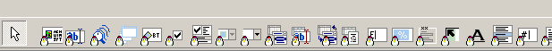

# sobakcc_vcl_package
sobakcc vcl package for DELPHI

[VCL] Sobakcc Controls Package for D7

개인적으로 사용하기 위하여 만든 컨트롤들로 FlatStyle의 컴포넌트가 대부분이다.

델파이 7에서 팩키지 등록함.

**[컨트롤 리스트]**

- TCCAoubtBox

- TCCAlignEdit

- TCCAnimation

- TCCAnimWnd

- TCCButton

- TCCCheckBox

- TCCCheckListBox

- TCCColorComboBox

- TCCComboBox

- TCCGAUGE

- TCCGroupBox

- TCCHint

- TCCLinkText

- TCCListBox

- TCCMaskEdit

- TCCMemo

- TCCPageControl

- TCCPanel

- TCCProgressBar

- TCCRadioButton

- TCCShape

- TCCSound

- TCCSpeedButton

- TCCSpinEdit

- TCCSpinEditFloat

- TCCSpinEditInteger

- TCCSplitter

- TCCTabControl

**[DB컨트롤 리스트]**

- TCCDBEdit

- TCCDBLookupComboBox

- TCCDBMemo

출처: https://sbrich.tistory.com/3775 [SB리치패밀리]
